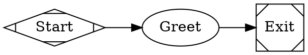

# Jungle Green Attractor

A DOT-based pipeline runner that uses directed graphs (defined in Graphviz DOT syntax) to orchestrate multi-stage AI workflows. Built in Go as an implementation of the [Attractor specification](https://github.com/strongdm/attractor).

Each node in the graph is an AI task (LLM call, human review, conditional branch, parallel fan-out, etc.) and edges define the flow between them.

---

## Table of Contents

- [Quick Start](#quick-start)
- [Installation](#installation)
- [Usage](#usage)
- [Architecture](#architecture)
- [DOT Pipeline Format](#dot-pipeline-format)
- [Node Types](#node-types)
- [Edge Routing](#edge-routing)
- [Pipeline Variables](#pipeline-variables)
- [Human-in-the-Loop](#human-in-the-loop)
- [Validation](#validation)
- [Logs and Checkpoints](#logs-and-checkpoints)
- [Go REST Spec Examples](#go-rest-spec-examples)
- [Extending Jungle Green Attractor](#extending-jungle-green-attractor)
- [Project Structure](#project-structure)

---

## Quick Start

```bash
# Build (either binary; they are equivalent)
go build -o junglegreenattractor ./cmd/junglegreenattractor/
go build -o jga ./cmd/jga/

# Run a simple pipeline
./junglegreenattractor run examples/gorestspec/simple_linear.dot
# or: ./jga run examples/gorestspec/simple_linear.dot

# Validate a pipeline without running it
./junglegreenattractor validate examples/gorestspec/init_rest_app.dot

# Run with variables and auto-approve human gates
./junglegreenattractor run examples/gorestspec/init_rest_app.dot \
  -auto-approve \
  -var module_name="github.com/acme/billing" \
  -var first_module="invoice"
```

---

## Installation

### Prerequisites

- Go 1.22 or later

### From Source

```bash
git clone https://github.com/adrianguyareach/junglegreenattractor.git
cd junglegreenattractor
go build -o junglegreenattractor ./cmd/junglegreenattractor/
go build -o jga ./cmd/jga/
```

The binaries are self-contained with no external dependencies. `junglegreenattractor` and `jga` are the same program; install either or both.

### Verify

```bash
./junglegreenattractor version
# junglegreenattractor 0.1.0
./jga version
# jga 0.1.0
```

### Run all tests

```bash
make test
```

Equivalent:

```bash
go test ./...
```

Use `make test-race` to run tests with the race detector.

---

## Usage

Commands below use `junglegreenattractor`; you can substitute `jga` in every example.

### `junglegreenattractor run` / `jga run`

Execute a DOT pipeline file.

```
junglegreenattractor run <pipeline.dot> [flags]
```

**Flags:**

| Flag | Default | Description |
|------|---------|-------------|
| `-log <dir>` | `.jgattractorlogs` | Directory for pipeline run logs |
| `-var key=value` | — | Set a pipeline variable (repeatable) |
| `-auto-approve` | `false` | Auto-approve all human-in-the-loop gates |
| `-simulate` | `true` | Run in simulation mode (no LLM backend) |

**Examples:**

```bash
# Basic run (logs go to .jgattractorlogs/<dot-basename>/)
junglegreenattractor run pipeline.dot

# Custom log directory
junglegreenattractor run pipeline.dot -log logs/.jgattractorlogs

# With pipeline variables
junglegreenattractor run add_module.dot \
  -var module_name="product" \
  -var entity_fields="ID string, Name string, Price int64"

# Auto-approve all human gates (CI/CD mode)
junglegreenattractor run full_feature.dot -auto-approve -var feature_description="Add search"

# Combine everything
junglegreenattractor run init_rest_app.dot \
  -log output/logs \
  -auto-approve \
  -var module_name="github.com/acme/api" \
  -var first_module="user"
```

### `junglegreenattractor validate` / `jga validate`

Check a pipeline for errors without executing it.

```bash
junglegreenattractor validate pipeline.dot
```

Returns exit code 0 if valid, 1 if there are errors. Warnings are printed but don't cause failure.

### `junglegreenattractor inspect` / `jga inspect`

View the details of a completed pipeline run — manifest, stage outcomes, and checkpoint state.

```bash
junglegreenattractor inspect .jgattractorlogs/init_rest_app
```

### `junglegreenattractor list` / `jga list`

List all pipeline runs in the log directory.

```bash
junglegreenattractor list
junglegreenattractor list /path/to/custom/logs
```

### `junglegreenattractor graph` / `jga graph`

Display the structure of a DOT pipeline: all nodes (with their resolved handler types), edges, conditions, and labels.

```bash
junglegreenattractor graph examples/gorestspec/init_rest_app.dot
```

### `junglegreenattractor version` / `jga version`

Print the version number.

### `junglegreenattractor help` / `jga help`

Show the help message.

---

## Architecture

Jungle Green Attractor implements the [Attractor specification](https://github.com/strongdm/attractor/blob/main/attractor-spec.md):

```
                    ┌─────────────┐
  .dot file ──────▶ │  DOT Parser │
                    └──────┬──────┘
                           │
                    ┌──────▼──────┐
                    │  Transforms │  (variable expansion, stylesheet)
                    └──────┬──────┘
                           │
                    ┌──────▼──────┐
                    │  Validator  │  (lint rules, structural checks)
                    └──────┬──────┘
                           │
                    ┌──────▼──────┐
                    │   Engine    │  (traverse graph, execute handlers)
                    └──────┬──────┘
                           │
              ┌────────────┼────────────┐
              │            │            │
       ┌──────▼──┐  ┌──────▼──┐  ┌──────▼──┐
       │ Handler │  │ Handler │  │ Handler │  ...
       │ (start) │  │(codergen│  │ (human) │
       └─────────┘  └─────────┘  └─────────┘
```

### Execution Lifecycle

1. **Parse** — Read the `.dot` file and produce an in-memory graph model
2. **Transform** — Expand variables, apply model stylesheet
3. **Validate** — Run lint rules; reject invalid graphs
4. **Execute** — Traverse from start node, executing handlers and selecting edges
5. **Finalize** — Write final checkpoint, emit completion events

### Core Loop

The engine traverses the graph node-by-node:

1. Check if current node is terminal (exit) — if so, check goal gates and stop
2. Execute the node's handler with retry policy
3. Record the outcome and update context
4. Save checkpoint
5. Select the next edge using the 5-step priority algorithm
6. Advance to the next node and repeat

---

## DOT Pipeline Format

Pipelines are defined as Graphviz `digraph` files. Jungle Green Attractor supports a strict subset of DOT syntax.

### Minimal Example



### Grammar Highlights

- **One digraph per file** — no multiple graphs, no undirected graphs
- **Directed edges only** — `->` (no `--`)
- **Comments** — `// line` and `/* block */` comments are supported
- **Chained edges** — `A -> B -> C [label="x"]` expands to `A->B` and `B->C`
- **Attribute blocks** — `[key=value, key="value"]` on nodes and edges
- **Defaults** — `node [shape=box]` sets defaults for subsequent nodes

### Graph Attributes

| Key | Type | Default | Description |
|-----|------|---------|-------------|
| `goal` | String | `""` | Pipeline goal. Available as `$goal` in prompts |
| `label` | String | `""` | Display name for the pipeline |
| `model_stylesheet` | String | `""` | CSS-like model/provider stylesheet |
| `default_max_retry` | Integer | `0` | Global retry ceiling |
| `retry_target` | String | `""` | Jump target for unsatisfied goal gates |

### Node Attributes

| Key | Type | Default | Description |
|-----|------|---------|-------------|
| `label` | String | node ID | Display name |
| `shape` | String | `"box"` | Determines the handler type |
| `type` | String | `""` | Explicit handler type override |
| `prompt` | String | `""` | LLM prompt (supports `$goal` and `$var`) |
| `max_retries` | Integer | `0` | Additional retry attempts |
| `goal_gate` | Boolean | `false` | Must succeed before pipeline can exit |
| `timeout` | Duration | — | Max execution time |
| `class` | String | `""` | Stylesheet class names |

### Edge Attributes

| Key | Type | Default | Description |
|-----|------|---------|-------------|
| `label` | String | `""` | Display caption and routing key |
| `condition` | String | `""` | Boolean guard expression |
| `weight` | Integer | `0` | Priority (higher wins) |
| `loop_restart` | Boolean | `false` | Restart pipeline with fresh logs |

---

## Node Types

The `shape` attribute determines which handler executes a node:

| Shape | Handler | Description |
|-------|---------|-------------|
| `Mdiamond` | **start** | Pipeline entry point (no-op). Exactly one required. |
| `Msquare` | **exit** | Pipeline exit point (no-op). Exactly one required. |
| `box` | **codergen** | LLM task. Expands `$goal` in prompt, calls backend. Default shape. |
| `hexagon` | **wait.human** | Human gate. Blocks until operator selects an option. |
| `diamond` | **conditional** | Routing point. Engine evaluates edge conditions. |
| `component` | **parallel** | Fan-out to multiple branches concurrently. |
| `tripleoctagon` | **parallel.fan_in** | Fan-in: consolidate parallel results. |
| `parallelogram` | **tool** | Execute a shell command (`tool_command` attribute). |
| `house` | **stack.manager_loop** | Supervisor loop over a child pipeline. |

Use the `type` attribute to explicitly set the handler, overriding shape-based resolution.

---

## Edge Routing

After a node completes, the engine selects the next edge using a **5-step priority algorithm**:

1. **Condition match** — Edges whose `condition` evaluates to true against outcome and context
2. **Preferred label** — Match the outcome's `preferred_label` against edge labels
3. **Suggested next IDs** — Match outcome's `suggested_next_ids` against edge targets
4. **Highest weight** — Among unconditional edges, highest `weight` wins
5. **Lexical tiebreak** — Alphabetically first target node ID

### Condition Expressions

Conditions use a minimal boolean language:

```
outcome=success                         # status check
outcome!=fail                           # negation
outcome=success && context.flag=true    # AND conjunction
context.loop_state!=exhausted           # context variable check
```

Supported operators: `=` (equals), `!=` (not equals), `&&` (AND).

---

## Pipeline Variables

Pass variables with `-var key=value`. They're expanded as `$key` in graph attributes, node prompts, and edge attributes.

```bash
junglegreenattractor run pipeline.dot -var module_name="user" -var version="v2"
```

In your `.dot` file:

```dot
graph [goal="Create the $module_name module ($version)"]
step [prompt="Implement $module_name for version $version"]
```

The built-in variable `$goal` is always available and resolves to the graph-level `goal` attribute.

---

## Human-in-the-Loop

Nodes with `shape=hexagon` (or `type="wait.human"`) block execution until a human selects an option. Options are derived from outgoing edge labels.

```dot
review [shape=hexagon, label="Review Changes"]
review -> ship_it [label="[A] Approve"]
review -> fix     [label="[F] Fix issues"]
```

In interactive mode, the operator sees:

```
[?] Review Changes
  [A] [A] Approve
  [F] [F] Fix issues
Select:
```

### Auto-Approve Mode

For CI/CD or automated runs, pass `-auto-approve` to automatically select the first option at every human gate.

### Accelerator Keys

Edge labels can include accelerator keys in these formats:

| Pattern | Example | Extracted Key |
|---------|---------|---------------|
| `[K] Label` | `[A] Approve` | `A` |
| `K) Label` | `A) Approve` | `A` |
| `K - Label` | `A - Approve` | `A` |

---

## Validation

Jungle Green Attractor validates pipelines before execution. Use `junglegreenattractor validate` (or `jga validate`) to check without running.

### Built-In Rules

| Rule | Severity | Check |
|------|----------|-------|
| `start_node` | ERROR | Exactly one start node (shape=Mdiamond) |
| `terminal_node` | ERROR | At least one exit node (shape=Msquare) |
| `reachability` | ERROR | All nodes reachable from start |
| `edge_target_exists` | ERROR | All edge targets reference existing nodes |
| `start_no_incoming` | ERROR | Start node has no incoming edges |
| `exit_no_outgoing` | ERROR | Exit node has no outgoing edges |
| `condition_syntax` | ERROR | Edge conditions parse correctly |
| `prompt_on_llm_nodes` | WARNING | Codergen nodes should have a prompt |
| `retry_target_exists` | WARNING | Retry targets reference existing nodes |
| `goal_gate_has_retry` | WARNING | Goal gates should have a retry target |
| `fidelity_valid` | WARNING | Fidelity mode values are valid |

---

## Logs and Checkpoints

Each pipeline run creates a directory under the log root named after the pipeline file (or `-name`):

```
.jgattractorlogs/
  init_rest_app/
    manifest.json              # Pipeline metadata
    checkpoint.json            # Execution state (for resume)
    start/
      status.json              # Node outcome
    plan/
      prompt.md                # Rendered prompt
      response.md              # LLM response (or simulated)
      status.json              # Node outcome
    implement/
      prompt.md
      response.md
      status.json
    ...
```

### Checkpoint Format

```json
{
  "timestamp": "2026-03-11T14:30:25Z",
  "current_node": "validate",
  "completed_nodes": ["start", "plan", "implement", "validate"],
  "node_retries": {},
  "context": {
    "graph.goal": "...",
    "outcome": "success",
    "last_stage": "validate"
  },
  "logs": []
}
```

### Status File Format

```json
{
  "outcome": "success",
  "notes": "Stage completed: validate",
  "context_updates": {
    "last_stage": "validate"
  }
}
```

---

## Go REST Spec Examples

Jungle Green Attractor ships with pre-built pipelines for the [Go REST Clean Architecture Spec](https://github.com/adrianguyareach/gorestspec). These are in `examples/gorestspec/`.

### Initialize a New REST Application

Scaffolds a complete Go REST service from scratch.

```bash
junglegreenattractor run examples/gorestspec/init_rest_app.dot \
  -var module_name="github.com/acme/billing" \
  -var first_module="invoice"
```

### Add a New Module (Vertical Slice)

Adds a new domain module to an existing service.

```bash
junglegreenattractor run examples/gorestspec/add_module.dot \
  -var module_name="product" \
  -var entity_fields="ID string, Name string, Description string, PriceInCents int64, CategoryID string, CreatedAt time.Time, UpdatedAt time.Time"
```

### Add a New Usecase

Adds a single usecase to an existing module.

```bash
junglegreenattractor run examples/gorestspec/add_usecase.dot \
  -var module_name="user" \
  -var usecase_name="DeactivateUser"
```

### Add Middleware

Adds cross-cutting middleware (JWT auth, CORS, rate limiting, etc.).

```bash
junglegreenattractor run examples/gorestspec/add_middleware.dot \
  -var middleware_type="jwt_auth"
```

### Database Migration Workflow

Creates, validates, and optionally applies a database migration — with a human review gate.

```bash
junglegreenattractor run examples/gorestspec/add_migration.dot \
  -var migration_description="Add a products table with name, price, and category_id columns"
```

### Full Feature Implementation

End-to-end feature with planning and review gates at both plan and implementation phases.

```bash
junglegreenattractor run examples/gorestspec/full_feature.dot \
  -var feature_description="Add a product catalog module with CRUD endpoints, category filtering, and price range search"
```

### Pipeline Quick Reference

| Pipeline | File | Purpose | Variables |
|----------|------|---------|-----------|
| Init App | `init_rest_app.dot` | Scaffold entire service | `module_name`, `first_module` |
| Add Module | `add_module.dot` | Add a vertical slice | `module_name`, `entity_fields` |
| Add Usecase | `add_usecase.dot` | Add usecase to module | `module_name`, `usecase_name` |
| Add Middleware | `add_middleware.dot` | Add middleware | `middleware_type` |
| Add Migration | `add_migration.dot` | Create DB migration | `migration_description` |
| Full Feature | `full_feature.dot` | End-to-end with reviews | `feature_description` |
| Simple Linear | `simple_linear.dot` | Test pipeline | — |
| Branching | `branching_example.dot` | Conditional routing | — |

---

## Extending Jungle Green Attractor

### Custom CodergenBackend

The `CodergenBackend` interface allows plugging in any LLM provider:

```go
type CodergenBackend interface {
    Run(node *dot.Node, prompt string, ctx *engine.Context) (*engine.Outcome, error)
}
```

Implement this interface to call OpenAI, Anthropic, Gemini, or any other LLM. The pipeline definition (the DOT file) does not change regardless of backend choice.

### Custom Handlers

Register custom handlers for new node types:

```go
reg := handler.NewRegistry()
reg.Register("my_custom_type", &MyHandler{})
```

Reference in DOT:

```dot
my_node [type="my_custom_type", prompt="Do custom work"]
```

### Custom Transforms

Transforms modify the graph between parsing and validation:

```go
type MyTransform struct{}

func (t *MyTransform) Apply(graph *dot.Graph) {
    // Modify graph in-place
}
```

### Model Stylesheet

Centralize LLM model selection with CSS-like rules in the graph attribute:

```dot
graph [
    model_stylesheet="
        * { llm_model: claude-sonnet-4-5; llm_provider: anthropic; }
        .code { llm_model: claude-opus-4-6; }
        #critical_review { llm_model: gpt-5.2; llm_provider: openai; }
    "
]
```

Selectors: `*` (all), `.class` (by class), `#id` (by node ID). Higher specificity wins.

---

## Code Quality

This codebase adheres to the [Universal Code Specification](https://github.com/adrianguyareach/universalcodespecification):

- **Single responsibility per file.** No source file exceeds ~200 lines. Handlers, validation rules, engine subsystems, and CLI commands are each in their own file.
- **Explicit error handling.** All I/O errors (file writes, JSON marshalling) are returned or logged — never silently swallowed.
- **Named constants over magic numbers.** File permissions, retry defaults, truncation limits, and timeouts are declared as named constants.
- **Dependency inversion.** The engine depends on `NodeHandler` and `HandlerResolver` interfaces, not concrete implementations. Handlers, backends, and interviewers are injected.
- **Small, focused functions.** The `Run()` loop is decomposed into `runLoop`, `executeStage`, `recordOutcome`, `advance`, `handleGoalGates`, and `safeExecute` — each under 30 lines.
- **Layered architecture.** `dot` (parsing) → `transform` → `validate` → `engine` (orchestration) → `handler` (execution) → `cli` (interface). Dependencies point inward.
- **Composable handlers.** New node types are added by implementing the `Handler` interface and registering with the `Registry` — no core engine changes needed (Open/Closed Principle).

---

## Project Structure

```
junglegreenattractor/
├── cmd/
│   ├── junglegreenattractor/
│   │   └── main.go                  # CLI entry (full name)
│   └── jga/
│       └── main.go                  # CLI entry (short alias)
├── internal/
│   ├── cli/
│   │   ├── cli.go                   # Command router + run/validate
│   │   ├── inspect.go               # jga inspect — view run details
│   │   ├── list.go                  # jga list — list pipeline runs
│   │   ├── graph.go                 # jga graph — display graph structure
│   │   └── usage.md                 # Embedded help text (go:embed)
│   ├── dot/
│   │   ├── ast.go                   # Graph, Node, Edge types
│   │   ├── lexer.go                 # DOT tokenizer
│   │   ├── parser.go                # DOT parser
│   │   └── parser_test.go
│   ├── engine/
│   │   ├── engine.go                # Runner, Run loop, retry orchestration
│   │   ├── edge.go                  # 5-step edge selection algorithm
│   │   ├── graph.go                 # Graph traversal helpers
│   │   ├── retry.go                 # Retry policy with exponential backoff
│   │   ├── logfiles.go              # Manifest + status file persistence
│   │   ├── context.go               # Thread-safe key-value context
│   │   ├── outcome.go               # StageStatus and Outcome types
│   │   ├── checkpoint.go            # Checkpoint save/load
│   │   ├── condition.go             # Condition expression evaluator
│   │   ├── condition_test.go
│   │   └── engine_test.go
│   ├── handler/
│   │   ├── registry.go              # Handler registry + shape mapping
│   │   ├── adapter.go               # Engine-handler bridge
│   │   ├── codergen.go              # LLM / simulation handler
│   │   ├── human.go                 # Human-in-the-loop gate
│   │   ├── tool.go                  # Shell command executor
│   │   ├── parallel.go              # Fan-out / fan-in handlers
│   │   ├── passthrough.go           # Start, Exit, Conditional, ManagerLoop
│   │   └── default_registry.go      # Wires all handlers into a registry
│   ├── interviewer/
│   │   ├── types.go                 # Interviewer interface
│   │   ├── console.go               # Interactive CLI interviewer
│   │   └── auto.go                  # Auto-approve + queue interviewers
│   ├── stylesheet/
│   │   └── stylesheet.go            # CSS-like model stylesheet
│   ├── transform/
│   │   └── transforms.go            # Variable expansion + stylesheet
│   ├── validate/
│   │   ├── validate.go              # Validation orchestration + types
│   │   └── rules.go                 # Individual lint rules
│   └── event/
│       └── event.go                 # Typed pub-sub event system
├── examples/gorestspec/              # Example pipelines
├── go.mod
└── README.md
```

---

## Based On

- [Attractor Specification](https://github.com/strongdm/attractor/blob/main/attractor-spec.md) — DOT-based pipeline runner spec
- [Go REST Clean Architecture Spec](https://github.com/adrianguyareach/gorestspec) — Example pipelines source

---

## License

MIT
